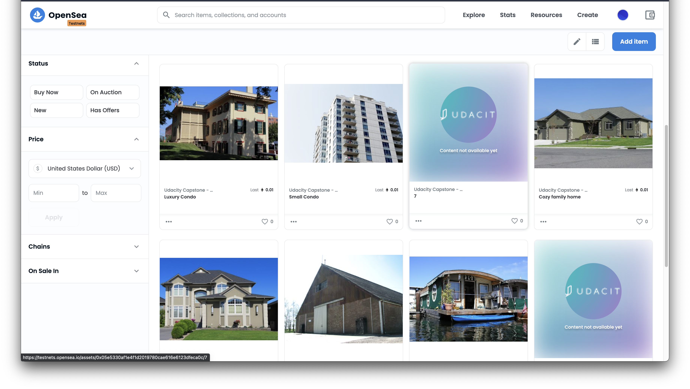

# Blockchain Capstone

Hey there reviewer. This is my submission for the capstone project. I belive I've covered all the requirements. 

Important links:
* Verifier address : 0xF1a64137cc22961C5Ed1968a7b7BB7BBe4252923
* Solution (token) addess: https://rinkeby.etherscan.io/address/0x05e5330Af1e4F1D2019780cAE616E6123DfEca0c
* Storefront's link: https://testnets.opensea.io/collection/unidentified-contract-b12p5rqiek
* Seller's account: 0xFd845a1a32183F7a5C4E2Ee5264aEa1f51b0BFeC
* Buyer's account: 0xb80888414e16b796625fb3570da3a1c2cf2e9ead
* The abis for `SquareVerifier` and `SolutionVerifier` are in the `abis` folder. If you need more, feel free to generate them with the `truffle compile` command.

The code can be tested with:
1. `cd eth-contracts`
2. `truffle test`

As explained in [this comment.](https://knowledge.udacity.com/questions/51703) I've minted 10 tokens unit the mint method from `ERC721Mintable`. Hope that's ok because there was no way I'd figure out 10 input combinations for minting the capstone token.